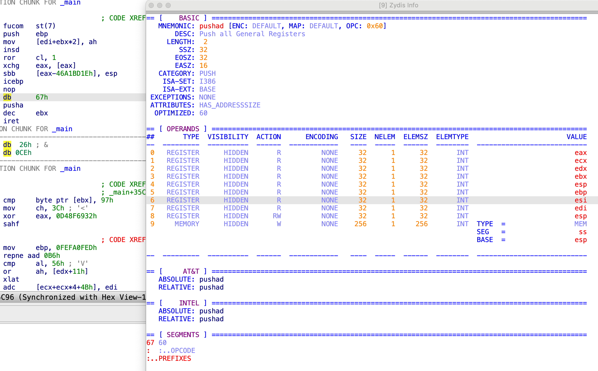
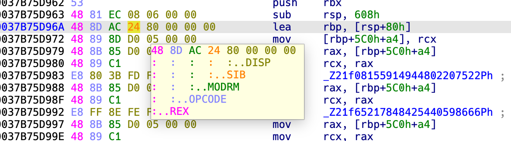

# Zydisinfo Plugin

The Zydisinfo plugin is an IDA Pro plugin that provides information about the instruction at the current cursor position. The plugin uses the [Zydis disassembler](https://github.com/zyantific/zydis) to decode the instruction and display information such as the instruction mnemonic, operands, and encoding information.


## Installation

To install the Zydisinfo plugin, follow these steps:

1. Copy the `zydisinfo.(dll|so|dylib)` file to the IDA plugins (`idaapi.get_ida_subdirs("plugins")`) folder.
2. Launch IDA Pro.
3. Navigate to the `Edit/Plugins` menu.
4. Choose `Zydis info` from the list of plugins.

## Building the Plugin

To build the Zydisinfo plugin, you will need to use the [ida-cmake](https://github.com/allthingsida/ida-cmake) build system.

Please refer to the ida-cmake documentation for instructions on how to set up and use the build system.

Once you have set up the ida-cmake build system, you can build the Instrlen plugin by running the following commands:

```
git clone https://github.com/milankovo/zydisinfo --recurse-submodules
cmake -B build -DEA64=YES -S src/
cmake --build build --config Release
```

Note: The Zydisinfo plugin is compatible with IDA Pro 9.0 SP1. While it has been tested with this version, it might be possible to use it with previous versions of IDA Pro. 

## Demonstration



## New in v1.1

- Introduced colored highlighting for instruction prefixes. This feature requires IDA Pro version 9.2 or newer due to a previously fixed bug in earlier versions.
- To configure the plugin, navigate to `Options -> Zydis Info...` in the menu.
